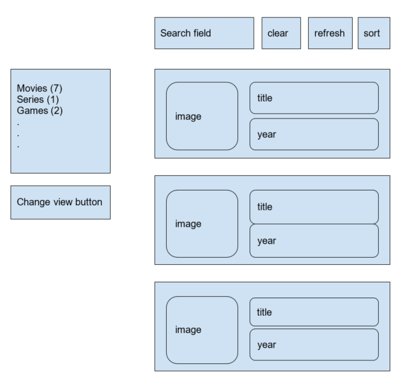

# Real Commerce Home Assignment

## Requirements:
### Create an angular application, using all angular elements(components, filters, services, etc)

1.	Make an api call to the response.json file
2.	Handle api call error if call fails
3.	Show all json response, split them by the type and count them
4.	Create tabs, by name and item count, each click will display the relevant items
5.	Create a toggle button, switching the view from list to grid
6.	Create a search field, when typing a value, display only the items that contain the value in the name or year
7.	Create a “clear” button - clears the search
8.	Create a refresh button that refresh the data again from the server
9.	Default sorting to the list is by name asc, create a sort button that switch between asc/desc
10.	In the item name - clicking on the item name will change the text into input with the name of the item, changing the value and blur will make an api call to update the item (no need to implement the server of course, just launch an api call to update). The api call will be triggered only if the value was actually changed
11.	Clicking on the image will go to an item route displaying the item details (design as you wish), include a “back” button in the item page

####  Notes
1.	Show formatted year 
2.	Dont show image if the image url is does not exists
3.	Use bootstrap

